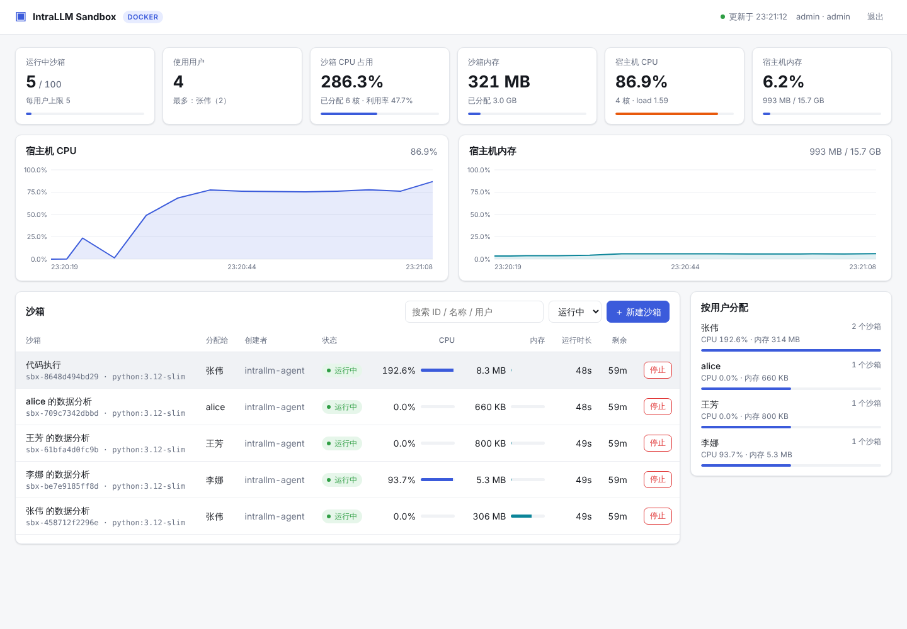
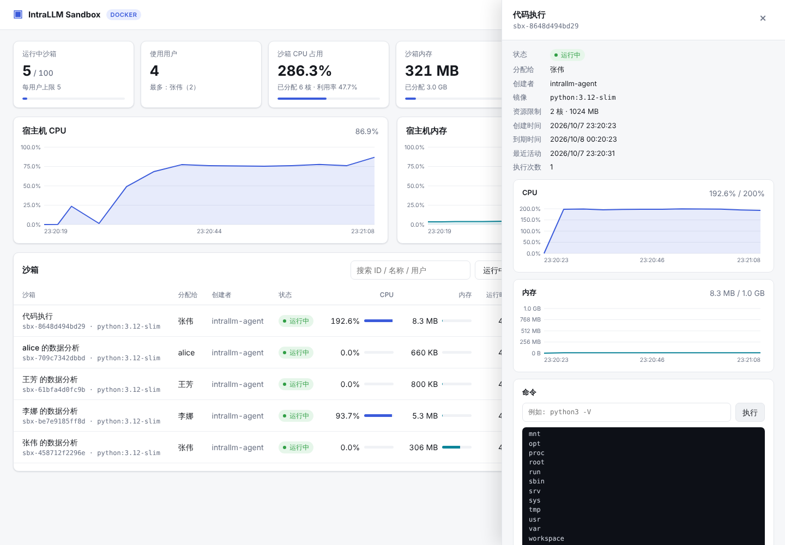

# IntraLLM Sandbox

企业级代码执行沙箱控制平面，供 **IntraLLM agent** 调用。它包含三部分：

- **沙箱运行时**：每个沙箱是一个加固的 Docker 容器，有 CPU、内存和进程数限制，默认不能联网，也没有任何 Linux capability。
- **控制 API 与 Agent 工具**：提供 REST API，以及 OpenAI 兼容格式的 function-calling 工具定义，IntraLLM agent 可以直接接入。
- **监控 Dashboard**：显示运行中的沙箱数量、每个沙箱分配给了谁、CPU 和内存占用、宿主机负载趋势，以及审计日志。





## 架构

```
 IntraLLM agent ──(agent token, owner=alice)──┐
 浏览器 Dashboard ──(admin / user token)───────┤
                                               ▼
                        ┌──────────── FastAPI 控制平面 ────────────┐
                        │  auth (admin/agent/user)  · 配额 · 审计    │
                        │  SandboxManager                           │
                        │   ├─ 后台采样线程 → MetricsStore (CPU/内存) │
                        │   └─ 回收线程 (TTL / 空闲超时 / 容器退出)   │
                        │  SQLite: sandboxes · tokens · audit       │
                        └───────────────┬───────────────────────────┘
                                        ▼ Runtime 抽象
                         DockerRuntime（生产） / LocalRuntime（仅开发）
                                        ▼
                    intrallm-sbx-xxxx 容器 (cap_drop=ALL, network=none,
                    no-new-privileges, cpu/mem/pids 限制, tini init)
```

| 模块 | 说明 |
|---|---|
| `intrallm_sandbox/runtime/docker_rt.py` | Docker 运行时：创建、exec（带超时）、读写文件、统计数据、销毁 |
| `intrallm_sandbox/runtime/local_rt.py` | 本地子进程运行时，**没有隔离**，只用于开发和测试 |
| `intrallm_sandbox/manager.py` | 生命周期、配额、TTL 和空闲回收、指标采样、重启后与容器状态对齐 |
| `intrallm_sandbox/agent_tools.py` | 给 LLM 用的工具定义和调度逻辑 |
| `intrallm_sandbox/api.py` | REST API、`/metrics`（Prometheus 格式），以及 Dashboard 静态页面 |
| `intrallm_sandbox/client.py` | Python SDK，以及给 agent 用的 `AgentToolkit` |
| `intrallm_sandbox/static/` | Dashboard 前端（原生 JS 加 SVG 图表，没有外部 CDN 依赖，可以直接在内网部署） |

## 快速开始

### 用 Docker Compose 部署（推荐）

```bash
export SANDBOX_ADMIN_TOKEN=$(openssl rand -hex 24)
docker compose up -d --build
# 打开 http://<host>:8080 ，用 SANDBOX_ADMIN_TOKEN 登录
```

给 IntraLLM agent 签发一个 token：

```bash
docker compose exec control-plane intrallm-sandbox create-token intrallm-agent --role agent
# 也可以调 API：POST /api/v1/tokens {"principal": "intrallm-agent", "role": "agent"}
```

### 本地开发

```bash
pip install -e '.[dev]'
docker build -t intrallm/sandbox:latest sandbox-image/      # 默认沙箱镜像
SANDBOX_ADMIN_TOKEN=dev python -m intrallm_sandbox serve --port 8080

# 机器上没有 Docker 时（注意：没有隔离）
SANDBOX_RUNTIME=local SANDBOX_ADMIN_TOKEN=dev python -m intrallm_sandbox serve

pytest            # 单元测试和 API 测试；检测到 Docker 时会自动跑 Docker 集成测试
```

## 角色与权限

| 角色 | 能做什么 |
|---|---|
| `admin` | 查看和控制所有沙箱、管理 token，能看到宿主机指标和全局审计日志 |
| `agent` | 服务身份（IntraLLM agent）。可以为任意用户（`owner`）分配沙箱，但只能操作自己创建的沙箱。以 `owner=X` 身份调用工具时，碰不到其他用户的沙箱 |
| `user` | 终端用户。只能看到和控制分配给自己的沙箱，Dashboard 也只显示自己的数据 |

## 接入 IntraLLM agent

方式一：走 HTTP，不限语言。

```bash
# 1. 获取工具定义（OpenAI function-calling 格式），作为 tools 传给 LLM
GET /api/v1/agent/tools

# 2. LLM 返回 tool_call 之后转发过来；owner 填当前对话的用户
POST /api/v1/agent/invoke
{"tool": "sandbox_exec", "owner": "alice",
 "arguments": {"sandbox_id": "sbx-...", "command": "python3 main.py"}}
# 返回 {"ok": true, "result": {...}}，或者 {"ok": false, "error": "..."}
# 出错时不会抛异常，而是把错误作为结果返回，LLM 可以据此自行修正
```

方式二：用 Python SDK，完整示例见 `examples/intrallm_agent_loop.py`。

```python
from intrallm_sandbox.client import SandboxClient, AgentToolkit
kit = AgentToolkit(SandboxClient(SANDBOX_URL, AGENT_TOKEN), owner="alice")
resp = llm.chat.completions.create(model=..., messages=messages, tools=kit.tools)
for call in resp.choices[0].message.tool_calls:
    messages.append({"role": "tool", "tool_call_id": call.id,
                     "content": kit.call(call.function.name, call.function.arguments)})
```

提供的工具：`sandbox_create`、`sandbox_exec`、`sandbox_write_file`、`sandbox_read_file`、`sandbox_list_files`、`sandbox_list`、`sandbox_destroy`。

## REST API

所有请求都要带 `Authorization: Bearer <token>`。完整的交互式文档在 `/docs`（Swagger）。

| 方法 | 路径 | 说明 |
|---|---|---|
| POST | `/api/v1/sandboxes` | 创建沙箱 `{owner, name, image, cpu, memory_mb, ttl_seconds, env, labels}` |
| GET | `/api/v1/sandboxes?active=true&owner=` | 列出沙箱，返回结果带最新的 CPU 和内存数据 |
| GET / DELETE | `/api/v1/sandboxes/{id}` | 查看详情 / 停止并销毁 |
| POST | `/api/v1/sandboxes/{id}/exec` | 执行命令 `{command, timeout, workdir, env}` |
| PUT / GET | `/api/v1/sandboxes/{id}/files` | 写文件 / 读文件（`?path=`） |
| GET | `/api/v1/sandboxes/{id}/ls?path=` | 列出目录 |
| POST | `/api/v1/sandboxes/{id}/extend` | 延长有效期 `{seconds}` |
| POST | `/api/v1/sandboxes/{id}/reassign` | 改分配给别的用户 `{owner}`（admin 和 agent 可用） |
| GET | `/api/v1/sandboxes/{id}/metrics` | 该沙箱的 CPU 和内存历史 |
| GET | `/api/v1/sandboxes/{id}/audit` | 该沙箱的审计日志 |
| GET | `/api/v1/dashboard/summary` | Dashboard 汇总数据：运行数、各用户分配情况、资源占用、宿主机趋势 |
| GET | `/metrics` | Prometheus 指标，可以接 Grafana 和告警 |
| POST / GET / DELETE | `/api/v1/tokens` | 管理 token（仅 admin） |

## 配置（环境变量）

| 变量 | 默认值 | 说明 |
|---|---|---|
| `SANDBOX_RUNTIME` | `docker` | 可选 `docker` 或 `local` |
| `SANDBOX_ADMIN_TOKEN` | — | 初始管理员 token |
| `SANDBOX_DB_PATH` | `./data/sandbox.db` | SQLite 文件路径 |
| `SANDBOX_DEFAULT_IMAGE` | `intrallm/sandbox:latest` | 默认沙箱镜像 |
| `SANDBOX_ALLOWED_IMAGES` | 空（不限制） | 镜像白名单，逗号分隔 |
| `SANDBOX_DEFAULT_CPU` / `SANDBOX_MAX_CPU` | `1` / `4` | CPU 核数 |
| `SANDBOX_DEFAULT_MEMORY_MB` / `SANDBOX_MAX_MEMORY_MB` | `1024` / `8192` | 内存限制（MB） |
| `SANDBOX_PIDS_LIMIT` | `256` | 进程数上限 |
| `SANDBOX_NETWORK` | `none` | Docker 网络模式；需要联网时可以指定一个受控网络 |
| `SANDBOX_DEFAULT_TTL` / `SANDBOX_MAX_TTL` | `3600` / `86400` | 沙箱有效期（秒） |
| `SANDBOX_IDLE_TIMEOUT` | `1800` | 空闲多少秒后自动回收 |
| `SANDBOX_EXEC_TIMEOUT` / `SANDBOX_MAX_EXEC_TIMEOUT` | `60` / `600` | 单条命令的超时（秒） |
| `SANDBOX_MAX_PER_OWNER` / `SANDBOX_MAX_TOTAL` | `5` / `100` | 每个用户和全集群的沙箱数量上限 |
| `SANDBOX_METRICS_INTERVAL` | `5` | 指标采样间隔（秒） |

## 安全说明

- 容器的默认配置：`cap_drop=ALL`、`no-new-privileges`、`network=none`、CPU/内存/pids 限制、swap 关闭；默认镜像以非 root 用户（uid 1000）运行。
- 控制平面需要挂载 `docker.sock`，这相当于宿主机的 root 权限。建议把控制平面部署在专用节点上，并且只让它在内网可访问。
- 隔离要求更高时，可以给 Docker 配置 [gVisor](https://gvisor.dev)（`runsc`）或 Kata Containers 作为 runtime。
- 数据库里只存 token 的 SHA-256 哈希。所有 exec 和文件写入都会记入审计日志。
- `/metrics` 不需要认证，但输出里带有用户名，应当只开放给内网的 Prometheus。

## 后续可以扩展

- 增加 Kubernetes 运行时（每个沙箱一个 Pod），实现多节点调度
- 对接企业 SSO（OIDC/LDAP），替代静态 token
- 持久化工作区卷，以及沙箱快照
- 提供 MCP Server 形式的工具接口
